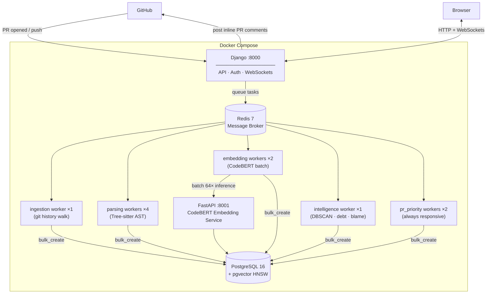

# Stratum — AI Powered Semantic Code Intelligence & Debt Evolution Engine🚀

> The name comes from geology — strata are layers of rock that accumulate over time, each layer telling a story of what happened before it. Your codebase is no different. Every commit adds a new layer. Stratum reads all of them.

Self-hosted AI code review and technical debt tracking for engineering teams.

Stratum does two things:

1. **Reviews Pull Requests automatically** — security vulnerabilities, dangerous functions, SQL injection, duplicate logic, complexity violations, and custom rules — posted as inline GitHub comments when a PR is opened.

2. **Tracks how technical debt evolves across your git history** — which files are getting worse, which patterns are spreading, which commits introduced the most debt, and how a PR will affect your codebase's long-term health before you merge.

Runs entirely on your own infrastructure. Code stays on your servers.

Supports: Python, JavaScript (+ JSX), TypeScript (+ TSX), Java, Go, Rust, C, C++, Ruby, PHP.

---

## Quick Start

**You need:** Docker Desktop and a GitHub account.

```bash
git clone https://github.com/adithyakrishhna/stratum
cd stratum
cp .env.example .env
# Fill in GitHub App credentials — see docs/setup.md for a step-by-step walkthrough
docker compose up -d
```

Open **http://localhost:8000**, log in with GitHub, connect a repository, click **Analyze**.

> **GitHub App callback URL** — before logging in, set the "User authorization callback URL"
> in your GitHub App settings (`github.com/settings/apps → Edit → Identifying and authorizing users`) to:
> `http://localhost:8000/accounts/github/login/callback/`
> Without this, GitHub blocks the OAuth redirect with a "redirect_uri not associated" error.

**Full setup guide (GitHub App, webhook tunnel, local dev): [docs/setup.md](docs/setup.md)**

---

## What Stratum Does

### Automatic PR Review

When a pull request is opened or updated, Stratum posts a review automatically:

| Category | What it checks |
|---|---|
| Hardcoded secrets | API keys, tokens, passwords, database URLs in source code |
| SQL injection | String-concatenated queries, f-string queries with user input |
| Dangerous functions | `eval()`, `exec()`, `pickle.loads()` and language equivalents |
| Missing authentication | HTTP endpoints without an auth decorator |
| Insecure randomness | `Math.random()` for tokens, `random.randint()` for passwords |
| Code complexity | Functions above your configured cyclomatic complexity limit |
| Function length | Functions longer than your configured line limit |
| Duplicate logic | Functions semantically similar to existing code (AI-powered) |
| Custom rules | Forbidden imports, naming conventions — defined in your `stratum.yaml` |

Each finding includes the exact file and line number, an explanation, and a suggested fix (via Groq API, optional).

### Technical Debt Tracking

After ingesting your git history, Stratum provides:

- **Debt Timeline** — any file's debt score plotted commit-by-commit across your full history
- **Velocity Heatmap** — your entire codebase as a color-coded file tree (red = deteriorating, green = improving)
- **Semantic Cluster Map** — groups of similar functions tracked across files and time
- **Blame Report** — commits ranked by debt introduced (by patterns spread, not lines changed)
- **PR Impact Prediction** — before you merge, see which existing patterns a PR will join and how much it accelerates their growth

---

## How It Compares

The tools below are in the same general space. This table covers the specific capabilities Stratum is built around. Check each tool's current documentation before making a purchasing or adoption decision — features and pricing change.

| | Stratum | SonarQube Community | CodeClimate | GitHub Advanced Security | CodeRabbit |
|---|---|---|---|---|---|
| **Self-hosted** | ✅ | ✅ | ❌ | ❌ | ❌ |
| **Code stays on your servers** | ✅ | ✅ | ❌ | ❌ | ❌ |
| **Free for private repos** | ✅ | ✅ | ❌ | ❌ | ❌ |
| **Inline PR line comments** | ✅ | ❌ | ✅ | ✅ | ✅ |
| **Security vulnerability detection** | ✅ | ✅ | ✅ | ✅ | ✅ |
| **Configurable rules** | ✅ | ✅ | ✅ | ⚠️ | ✅ |
| **Semantic duplicate detection (AI/embedding-based)** | ✅ | ❌ | ❌ | ❌ | ⚠️ |
| **Per-commit debt score history** | ✅ | ❌ | ❌ | ❌ | ❌ |
| **Full git history ingestion** | ✅ | ❌ | ❌ | ❌ | ❌ |
| **Semantic cluster tracking over time** | ✅ | ❌ | ❌ | ❌ | ❌ |
| **Velocity heatmap** | ✅ | ❌ | ❌ | ❌ | ❌ |
| **PR debt impact prediction** | ✅ | ❌ | ❌ | ❌ | ❌ |
| **AI-generated fix suggestions** | ✅ | ❌ | ❌ | ⚠️ | ✅ |

**Notes:**
- **SonarQube Community — Inline PR comments:** Posts PR status checks only. Inline line-level comments require Developer or Enterprise edition.
- **CodeClimate — Free for private repos:** Free for public open-source repositories. Private repos require a paid plan.
- **GitHub Advanced Security — Self-hosted / Free for private repos:** GitHub Enterprise Server can be self-hosted but requires a paid licence. Free only for public repos on github.com.
- **CodeRabbit — Free for private repos:** Free tier available for public repositories only.
- **CodeRabbit — Semantic duplicate detection:** Reviews the changed code in a PR using AI. Cross-codebase duplicate detection using stored embeddings is not a documented feature.
- **GitHub Advanced Security — AI fix suggestions:** Copilot Autofix provides suggestions but requires a separate Copilot subscription on top of Advanced Security.

> This comparison is based on each tool's publicly available documentation. Features, pricing, and editions change frequently — verify against current vendor documentation before deciding.

---

## The 7 Dashboard Screens

| Screen | What it shows |
|---|---|
| Repository Overview | Health score, top deteriorating files, spreading pattern count |
| PR Review Center | All PR reviews, findings by severity, debt impact per PR |
| Debt Timeline | Any file's debt score plotted commit-by-commit with inflection points |
| Semantic Cluster Map | Bubble chart of recurring code patterns, colored by growth rate |
| Velocity Heatmap | Full codebase as a color-coded file tree |
| Blame Report | Commits ranked by debt introduced, exportable CSV |
| Pipeline Monitor | Live ingestion progress via WebSocket, failed task retry |

**Every screen and term explained in plain English: [docs/features.md](docs/features.md)**

---

## Who Is It For?

**Individual developers** — automated PR review without a SaaS subscription, and visibility into where your codebase is drifting over time.

**Engineering teams** — consistent review quality across every PR, data to guide refactoring priorities, and long-term visibility into how technical debt accumulates across sprints.

**Organizations** — code stays on your servers, no per-seat pricing, audit your full engineering history across all repositories.

---

## Security

- Code never leaves your infrastructure
- External calls: GitHub API (required) + Groq API (optional, can be disabled)
- Raw source code not stored by default (`STORE_RAW_CODE=false`)
- HMAC-SHA256 verification on every GitHub webhook request
- All credentials in `.env` only — never in source code

**Full security details: [docs/security-architecture.md](docs/security-architecture.md)**

---

## Documentation

| | |
|---|---|
| [Setup Guide](docs/setup.md) | Docker, GitHub App, ngrok, local dev, troubleshooting |
| [Feature Guide](docs/features.md) | Every screen and term explained in plain English |
| [Configuration](docs/configuration.md) | `stratum.yaml` and `.env` reference |
| [Security](docs/security-architecture.md) | Data flow, privacy, credential handling |
| [Contributing](docs/contributing-guide.md) | Development setup and contribution guidelines |

---

## Architecture



---

## Demo

<!-- To embed the demo: edit this file on github.com, drag-drop docs/demo.mp4 into the editor.
     GitHub uploads it to their CDN and generates a URL — paste it here to replace this comment. -->

---

## Tech Stack

| Layer | Technology |
|---|---|
| **Backend** | Django 5 |
| **Task Queue** | Celery + Redis 7 |
| **Database** | PostgreSQL 16 + pgvector (HNSW index) |
| **Embedding Microservice** | FastAPI + CodeBERT (microsoft/codebert-base) |
| **AST Parsing** | Tree-sitter (Python, JS, TS, Java, Go, Rust, C, C++, Ruby, PHP) |
| **Clustering** | scikit-learn DBSCAN |
| **Frontend** | React 18 + Vite + Tailwind CSS |
| **Charts** | Chart.js 4 |
| **Auth** | Django Allauth + GitHub OAuth |
| **Real-time** | Django Channels (WebSockets) |
| **LLM Suggestions** | Groq API (opt-in, free tier) |
| **Containerization** | Docker Compose |
